<div align="center">

[](https://git.io/typing-svg)

### Open-source software developer • Cybersecurity student • Low-level programming enthusiast

<p>
Building software because it's fun.
</p>


</div>

---

## About Me

```text
$ whoami

Name        :: zimavi
Location    :: Kyiv, Ukraine 🇺🇦
Occupation  :: Cybersecurity Student
Currently   :: Building YukihanaOS
Interests   :: Operating Systems
               Low-level Programming
               Compilers
               Programming Languages
               Security
               Cryptography
               CLI Tools
```

I'm zimavi, an open-source software developer and cybersecurity student from **Kyiv, Ukraine**.

I enjoy building software simply because I find it interesting—from experimental operating systems and low-level infrastructure to developer tooling. My current focus is **YukihanaOS**, an operating system built on top of CosmosOS Gen3 with a modern architecture and NativeAOT.

Outside of programming, you'll probably find me listening to music, exploring interesting technologies, or spending way too much time redesigning things that already worked.

---

# 🚀 Featured Projects

## ❄ YukihanaOS

> Experimental operating system built on top of CosmosOS Gen3.

### Highlights

- Modern architecture
- User & permission system
- Designed from scratch

[Repository](https://github.com/yukihana-project/YukihanaOS)

# 🛠 Tech Stack

<p>


</p>

Additional technologies:

- CosmosOS
- GitHub Actions
- Rider
- VMware
- QEMU

---

# 💻 What I Enjoy Building

- Operating systems
- Developer tooling
- CLI applications
- Low-level software
- Programming language infrastructure
- Build systems
- Security-related software
- Experimental projects

---

# 📊 GitHub

<div align="center">
  
</div>
<div align="center">
  
</div>

---

<div align="center">

> "Programs must be written for people to read, and only incidentally for machines to execute."

— Harold Abelson

</div>

---

# 📈 Activity

[](https://github.com/ashutosh00710/github-readme-activity-graph)

---

# 📚 Currently Learning

```text
• Operating System Development
• Compiler Design
• Filesystem Design
• Security
• Cryptography
```

---

# 📦 Open Source

I enjoy contributing to open-source software and building projects that are educational, maintainable, and fun to experiment with.

If you've found one of my projects useful, consider leaving a ⭐ or contributing.

---

# ❤️ Support

If you'd like to support my work:

<div align="center">

<a href="https://ko-fi.com/zimavi">

</a>

</div>

Even a small donation helps fund development, testing, and the occasional cup of coffee.

---

# 🤝 Contact

<div align="center">

<a href="mailto:mail@zimavi.net.ua">

</a>

</div>

---

<div align="center">

### Thanks for stopping by.


```text
         *
      *     *
   *    ❄    *
      *     *

Keep building.
Keep learning.
Keep creating.
```

*"The best way to predict the future is to implement it."*

</div>
